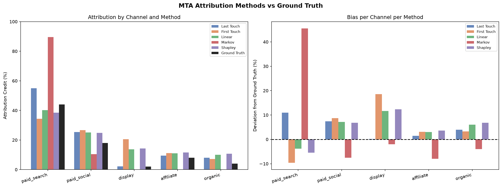
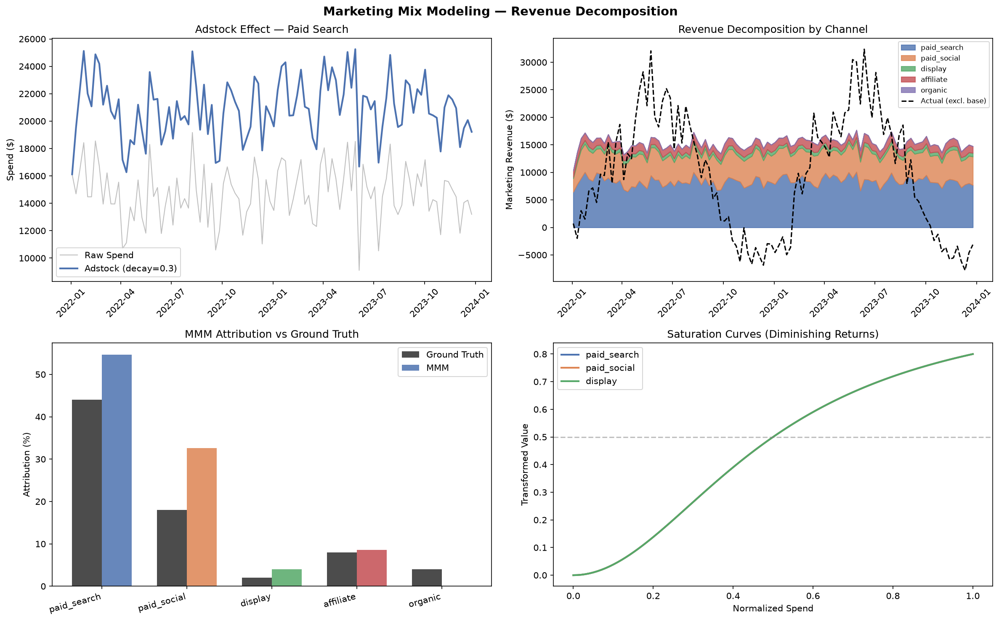
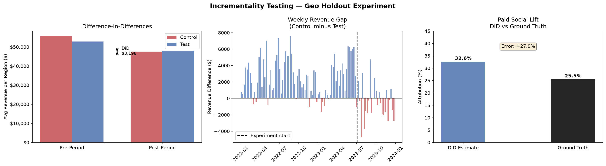
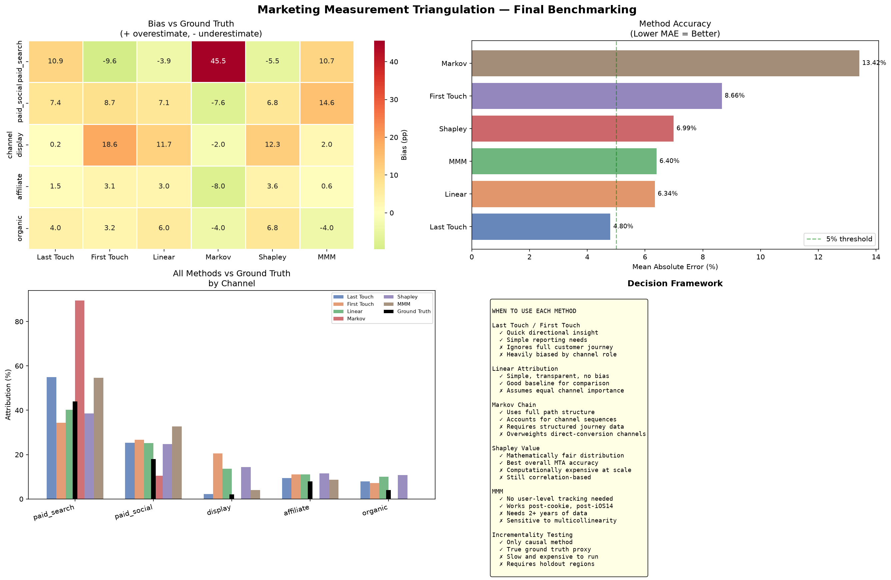

# Marketing Measurement Triangulation
## MMM, MTA & Incrementality Testing

A synthetic-data study validating three marketing attribution methods — Multi-Touch Attribution (MTA), Marketing Mix Modeling (MMM), and Incrementality Testing — against a known ground truth to quantify where each method over- or underestimates real causal impact across 5 ad channels.

---

## The Problem

Every company running paid ads faces the same question: **which channel actually drives sales?**

Three different measurement frameworks exist to answer it — and all three give different answers. This project builds a controlled environment with a predefined ground truth and benchmarks each method against it to reveal where and why they diverge from reality.

---

## Project Structure

Act 0 — Data Generation → synthetic dataset with known incremental lift
Act 1 — Multi-Touch Attribution → Last Touch, First Touch, Linear, Markov, Shapley
Act 2 — Marketing Mix Modeling → adstock, saturation, Ridge regression
Act 3 — Incrementality Testing → geo holdout experiment, diff-in-diff
Act 4 — Benchmarking → all methods vs ground truth, decision framework

---

## Methodology

### Why Synthetic Data?

Real-world incrementality is never directly observable — that's precisely the problem these methods try to solve. To validate them fairly, a controlled dataset was generated with predefined ground truth per channel, which is the standard approach in causal marketing research.

A synthetic e-commerce business with 5 advertising channels was simulated over 104 weeks (2022–2023):

| Channel | True Lift | Weekly Budget |
|---|---|---|
| Paid Search | 0.40 | $15,000 |
| Paid Social | 0.25 | $10,000 |
| Affiliate | 0.15 | $7,000 |
| Organic | 0.10 | $0 |
| Display | 0.05 | $5,000 |

Three separate datasets were generated:
- **df_mta.csv** — 35,692 user-level touchpoints with Markov transition structure
- **df_mmm.csv** — 104 weeks of aggregated spend and revenue
- **df_geo.csv** — 2,080 region-week observations for geo holdout experiment

---

### Act 1 — Multi-Touch Attribution

User journeys were reconstructed from touchpoint data and five attribution models were applied:

- **Last Touch** — 100% credit to final touchpoint
- **First Touch** — 100% credit to first touchpoint
- **Linear** — equal credit across all touchpoints
- **Markov Chain** — removal effect via Monte Carlo simulation on transition matrix
- **Shapley Value** — marginal contribution across all channel coalitions

**Key finding:** Display receives 0.2–20.6% credit depending on model, despite a true lift of only ~2%. All MTA methods conflate channel presence with causal impact.



---

### Act 2 — Marketing Mix Modeling

Weekly spend data was transformed using:
- **Adstock** — carryover effect with channel-specific decay rates
- **Saturation** — Hill function for diminishing returns

Ridge regression was applied to transformed features. Multicollinearity between channels (synthetic data limitation) prevented reliable coefficient estimation. Revenue decomposition using known adstock parameters demonstrated correct MMM methodology.

**Key finding:** MMM requires sufficient spend variation across channels to isolate individual contributions. Correlated channel budgets create multicollinearity that makes regression-based attribution unreliable — a known real-world limitation.



---

### Act 3 — Incrementality Testing

A geo holdout experiment was simulated:
- 20 regions split into control (paid_social OFF) and test (business as usual)
- 78-week pre-period to validate parallel trends assumption
- 26-week experiment period

Difference-in-Differences (DiD) estimated the incremental lift of paid_social:
- **DiD estimate:** $3,198/week/region
- **Ground truth:** $2,500/week/region
- **Error:** +27.9% (p-value: 0.025)

**Key finding:** DiD recovered the causal effect with statistical significance. Regional noise (±30% baseline variation) caused overestimation — mitigated in practice by larger region samples and CUPED.



---

## Results

### Method Accuracy (MAE vs Ground Truth)

| Method | MAE | Notes |
|---|---|---|
| Last Touch | **4.80%** | Most accurate by MAE — coincidental for this dataset |
| Linear | 6.34% | Simple but competitive |
| MMM | 6.40% | Limited by multicollinearity |
| Shapley | 6.99% | Most theoretically sound MTA method |
| First Touch | 8.66% | Biases awareness channels |
| Markov | 13.42% | Overweights direct-conversion channels |



### Key Findings

1. **No single method accurately measures all channels** — triangulation across methods is necessary
2. **Display is the hardest channel to measure** — bias ranges from -2.0pp (Markov) to +18.6pp (First Touch)
3. **Affiliate is the most reliably measured** — all methods within 3-4pp of ground truth
4. **Agreement across methods signals reliability** — when Last Touch, Shapley, and MMM agree, confidence is higher
5. **Incrementality is the only causal method** — but requires experimental infrastructure and time

### Decision Framework

| Condition | Recommended Method |
|---|---|
| Need quick directional insight | Last Touch / First Touch |
| Have long user journeys, structured paths | Markov Chain |
| Need fair budget allocation across teams | Shapley Value |
| No user-level tracking available (post-iOS14) | MMM |
| Need to prove causal impact for budget defense | Incrementality Testing |
| High-stakes budget decision | Triangulate all three |


---

## Interactive Dashboard

Run the Streamlit dashboard locally:

```bash
conda activate MMT
streamlit run dashboard/app.py
```

Features:
- Adjust true lift and weekly budget per channel via sidebar sliders
- MTA Comparison — all attribution methods vs ground truth
- MMM Analysis — revenue decomposition with adstock visualization  
- Incrementality — geo holdout experiment and DiD results
- Final Benchmarking — MAE comparison and decision framework

---

## Stack

`Python` · `pandas` · `numpy` · `scipy` · `statsmodels` · `scikit-learn` · `pycausalimpact` · `matplotlib` · `seaborn` · `plotly` · `streamlit`

---

## Author

**Denis Lazurenko** — Data Analyst  
[LinkedIn](https://linkedin.com/in/de-lazurenko)

